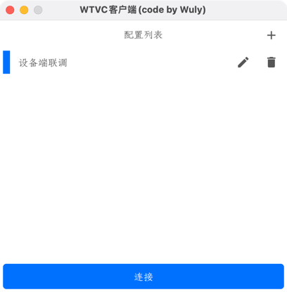
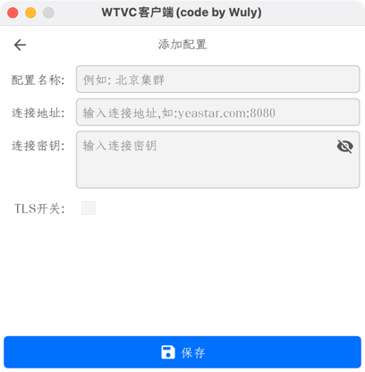
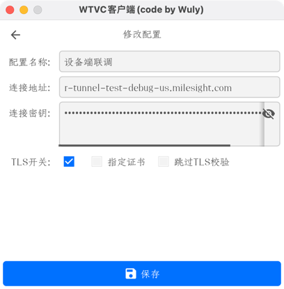
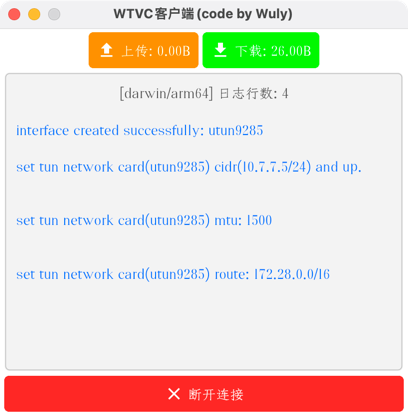

# Websocket tun vpn

`A simple VPN based on websocket and tun devices written in Go.`

## main page,show the list of configs.
 
## add config page.

## modify config page.

## connect to `Websocket tun vpn server` page.

## system tray menu.

